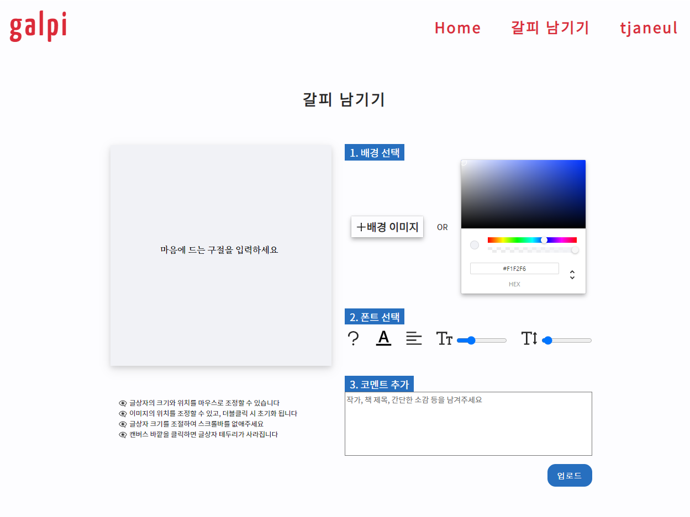
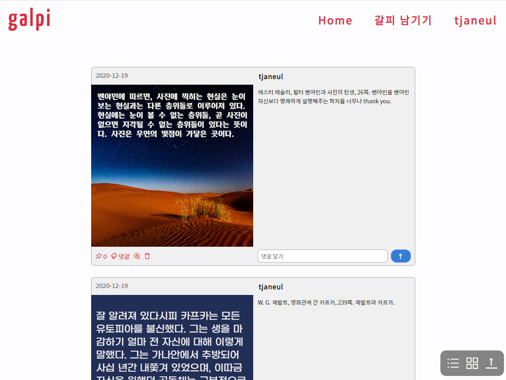
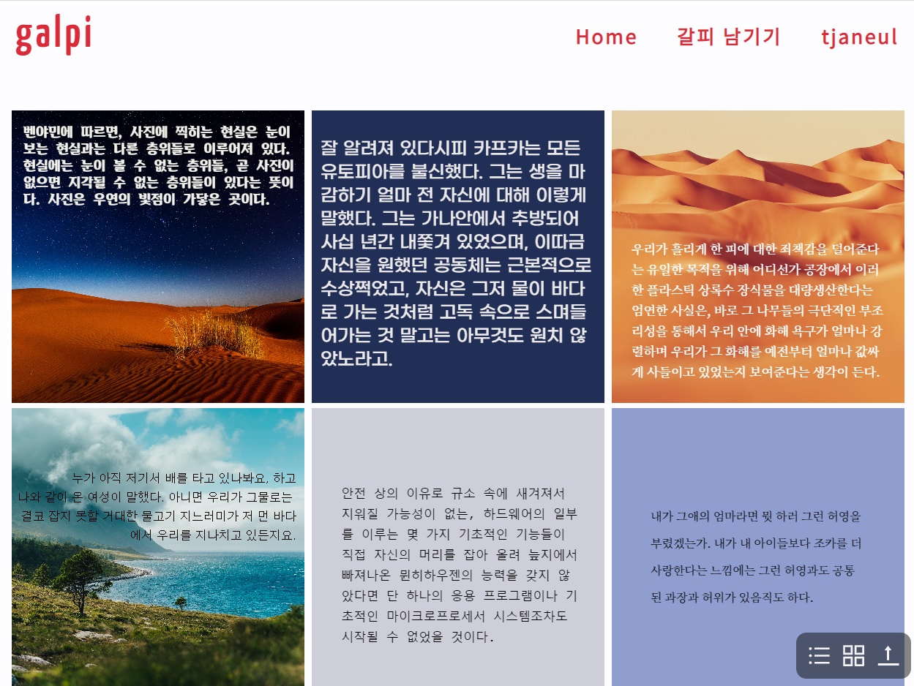

# 갈피 | Galpi
#### 마음에 드는 책의 글귀를 이미지 위에 기록하고 편집하여 업로드할 수 있는 소셜 웹 어플리케이션
#### An social web application. Users can edit and upload their favorite quotes on the image they like.

### <a href="https://galpi.herokuapp.com/" target="_blank">**웹 사이트로 이동**</a>
---
## Features

### 🎨 원하는 이미지를 배경 이미지로 선택
원하는 이미지를 직접 선택하거나 색상표로 색상을 고를 수 있다. 배경 이미지를 직접 고르고 배경색을 선택한 뒤, 배경 이미지를 드래그 하여 위치를 조정하면 배경 이미지와 색상을 혼합하여 사용할 수 있다.
> 해당 기능에 대한 코드는 `/client/src/components/view/PostingPage/` 에서 확인 가능   

### 📝인용할 글귀를 자유롭게 편집
글꼴, 색상, 크기, 정렬, 글간격을 선택할 수 있고, 캔버스 위의 글상자를 직접 클릭하거나 드래그 하면 **글상자의 크기와 위치**를 조정할 수 있다.
> 해당 기능에 대한 코드는 `/client/src/components/view/PostingPage/font/` 에서 확인 가능

</img>

### 🧐 다른 사람의 포스트를 실시간으로 확인
- 로그인 하지 않았을 때, 메인 화면의 <a href="https://galpi.herokuapp.com/thumbnails" target="_blank">**갈피들**</a> 메뉴에서 실시간 포스트 섬네일들을 확인 가능
- 로그인 했을 때, **Home** 메뉴에서 바로 확인 가능하며 List 혹은 Thumbnail로 뷰를 선택할 수 있다. 또한, 직접 **좋아요**를 누르거나 **댓글**을 남길 수 있다.

</img>   </img>

### 👤 개별 유저 프로필 페이지
`https://galpi.herokuapp.com/user/[유저 아이디]`로 이동하여 간단한 프로필과 해당 유저가 올린 포스트를 모아볼 수 있다.


### 📋 대시보드 Dashboard
로그인 후에 대시보드(`https://galpi.herokuapp.com/dashboard`)로 이동하면 간단한 자신의 회원 정보를 볼 수 있고, 회원 탈퇴가 가능하다.

---
## Development Mode
```
cd server
npm run dev
```
---

## Structure
    |-- client   
    |-- server   

FE | 클라이언트 폴더   

    |-- client        
        |-- public
        |-- src
            |--_actions    ┐ 
            |--_reducers   ├ 리덕스 관련 Redux related directories
            |--_store      ┘ 
            |--components
                |--containers   // reusable containers such as infinite scroll ...
                |--views        // views composing the each web page
            |--route       // Redirect Router based on user authentication
            ...


BE | 서버 폴더   

    |-- server
        |-- config  // config files mostly imported on index.js
        |-- error
        |-- middleware
        |-- models  // DB models built on a mongoose API schema
        |-- public  // static files built in client dir
        |-- routes  // routes for REST APIs 
        |-- validation  // validate data such as req.body, user inputs, using hapi
---


